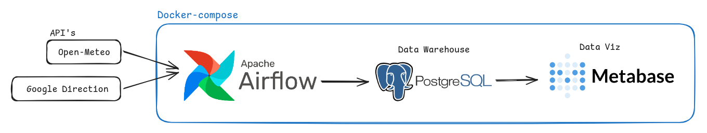
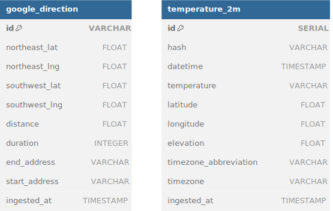
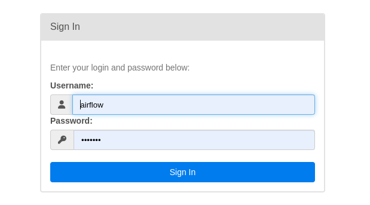
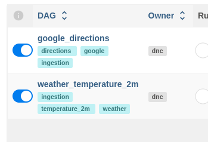

# Objetivo do Projeto
    Contruir um pipeline de dodos que envolva as seguintes etapas:
1. **Extração de Dados:** Extrair dados sobre o [clima](https://open-meteo.com/en/docs#latitude=-23.1794&longitude=-45.8869&timezone=America%2FSao_Paulo) e [trânsito](https://developers.google.com/maps/documentation/directions/overview);
2. **Limpeza e Transformação**;
3. **Modelagem de Dados**;
4. **Integração com o Banco de Dados**;
5. **Visualização de Dados**; 

# Arquitetura do projeto

    .
    ├── dags
    │   ├── commons
    │   ├── dags_files_1.py
    │   └── dags_files_2.py
    ├── docker
    ├── docs
    └── tests

## API's
1. **Open-Meteo**: API de simples consulta em python, onde a mesma não precisa de autenticação e é gratuita, nos disponibilizando diversas categorias de dados históricos como:
    
    - Temperatura
    - Umidade Relativa
    - Chuva
    - Vento 

2. **Google Diretions**: API do Google responsável por nos entregar os trajetos de um ponto **A** ao ponto **B**. Nela é necessário o acesso ao console do Google Cloud e criação de uma *key* para autenticação na API.

## Orquestrador
Para orquestrar nossas tarefas de maneira automática, foi utilizado o orquestrador Open-Source `Apache Airflow`. Nele criaremos algumas tarefas que farão a requisição nas api's e conexão com o banco de dados para salvar os dados coletados no banco de dados.

## Banco de Dados
Par o nosso banco de dados relacional(Data Warehouse), vamos utilizar um tradicional e popular `Postgres 16`, onde nele, serão criadas tabelas para cada segmento de cada dado advindo das api's.

## Data Viz
E para vizualização dos nossos dados vamos utilizar o `Metabase`, outra ferramenta Open Source, com facil processo para criação dos nossos dados.

#  Gerenciamento da aplicações
Para gerenciar nossos apps, vamos construí-los utilizando o Docker-Compose. Com o objetivo de facilitar a instalação, manutenção e replicabilidade. Para encontrar as configurações, acesse `docker/` .

`💡 FYI` Quando o Docker-Compose iniciar o Postgres, as tabelas serão criadas automaticamente e as DAG's também serão carregadas para o airflow de forma automática. 

# Modelagem dos Dados 
Como em nosso exemplo estamos usandos poucos dados os modelos conceituais e lõgicos acabaram sendo menos relevantes.

## Físico

# Requisitos
Esse ambiente foi construido sobre o linux e precisaremos das seguintes tecnologias:

- Linux;
- Docker e Docker-Compose;
- Pip;
- Make
- Python;
- Navegador;
- Conexão Internet;
- Dbeaver, Postgres ou similares;

# Instalando o ambiente
Primeiramente, precisaremos criar algumas variaveis de ambiente na sua máquina, por isso execute o comando a seguir no seu terminal:

    export POSTGRES_DW_USER=postgres
    export POSTGRES_DW_PASSWORD=postgres
    export POSTGRES_DW_HOST=datawarehouse
    export POSTGRES_DW_PORT=5432
    export POSTGRES_DW_GOOGLE_API_KEY="CHAVE_GERADA_NO_GOOGLE_CLOUD"

Com isso, podemos iniciar nosso projeto com:

    make run

Para iniciar nossos pipelines acesse utilizando o **Username** `airflow` e **Password** `airflow` 
    
    http://localhost:8090/

## Executando Pipelines
Assim que estiver no ambiente, inicies as DAGs disponíveis e em poucos segundos elas ja deverão estar finalizadas com sucesso.

## Dados
Os dados que serão coletados pelos pipelines poderão ser vizuados também pelo Dbeaver ou Postgres:

    USER=postgres
    PASSWORD=postgres
    HOST=localhost
    PORT=5438

## Metabase
Acesse em http://localhost:3000

`TBD`

# Testes Unitários

Criar  Ambiente Python
	
    virtualenv .venv

Ativar Ambiente Python

	source .venv/bin/activate

Instalar Dependências

    pip install -r requirements.txt

Rodar Teste

    pytest tests

Desaivar Ambiente Python
	
    deactivate
